# 🛰️ SAR Image Colorization with MLOps on GCP

This project demonstrates an end-to-end MLOps pipeline for training a CycleGAN-based model to colorize Sentinel-1 (SAR) grayscale satellite images into pseudo Sentinel-2 optical-like RGB images. The pipeline leverages Google Cloud Platform (GCP) services, MLflow, Docker, and GitHub Actions.

<!-- Image placeholder: Overall architecture diagram -->

## ✨ Features

*   **Data Management:** Uses Google Cloud Storage (GCS) for scalable storage of large image datasets.
*   **Experiment Tracking:** Leverages a GCP-hosted MLflow Tracking Server (with Cloud SQL backend and GCS artifact store) for logging experiments, parameters, metrics, and models.
*   **Model Registry:** Uses MLflow Model Registry with Aliases and Tags for versioning and managing model lifecycles.
*   **Containerization:** Dockerized environments for both training and the Streamlit application, ensuring consistency.
*   **CI/CD Automation:**
    *   GitHub Actions automatically build and push Docker images to Google Artifact Registry.
    *   GitHub Actions automatically deploy the Streamlit application to Google Cloud Run.
*   **Interactive Application:** A Streamlit web application for users to upload S1 images and receive colorized S2-like outputs.
*   **Cloud-Native:** Designed to run primarily on Google Cloud Platform.

## 🚀 Core Technologies

*   **Python:** Main programming language.
*   **PyTorch:** Deep learning framework for the CycleGAN model.
*   **MLflow:** For experiment tracking, model registry, and MLOps workflow management.
*   **Docker:** For containerizing training and application environments.
*   **Google Cloud Platform (GCP):**
    *   **Google Cloud Storage (GCS):** For data and MLflow artifact storage.
    *   **Google Compute Engine (GCE):** For hosting the MLflow server and running training jobs.
    *   **Cloud SQL:** For MLflow metadata backend.
    *   **Secret Manager:** For secure credential storage.
    *   **Artifact Registry:** For storing Docker images.
    *   **Cloud Run:** For deploying and serving the Streamlit application.
    *   **Workload Identity Federation:** For secure authentication between GitHub Actions and GCP.
*   **GitHub Actions:** For CI/CD automation.
*   **Streamlit:** For building the interactive web application.

## ⚙️ MLOps Pipeline Overview

1.  **Data Preparation:** Sentinel-1/2 image pairs are stored in GCS.
2.  **Training:**
    *   The training environment is containerized using Docker (`Dockerfile.train`).
    *   Training is initiated manually (by running the Docker container on GCE).
    *   The training script (`src/train.py`) loads data from GCS, trains the CycleGAN, and logs experiments, metrics, and model versions to the MLflow server.
3.  **Model Management:**
    *   Trained models are registered in the MLflow Model Registry.
    *   Model versions are managed using Aliases (e.g., `prod-candidate`) and Tags.
4.  **Application Deployment:**
    *   The Streamlit application (`streamlit_app.py`) is containerized (`Dockerfile.app`).
    *   It loads a specific model version from MLflow based on a configured alias.
    *   GitHub Actions automatically build the Streamlit app image and deploy it to Google Cloud Run on pushes to `main`.
    
    
## 🏁 Getting Started / Reproducing

Please refer to the detailed docs.md for comprehensive setup instructions, including:
*   GCP service setup (GCS, Cloud SQL, GCE, Secret Manager, Artifact Registry, Cloud Run).
*   MLflow server deployment on GCE.
*   Workload Identity Federation configuration.
*   Local environment setup and configuration file (`config/config.yaml`) adjustments.
*   GitHub Actions workflow setup and secrets configuration.

**Key steps to reproduce:**
1.  Clone this repository.
2.  Set up all required GCP services and IAM permissions.
3.  Deploy the MLflow server on a GCE VM.
4.  Configure `config/config.yaml` with your GCP project details, GCS paths, and MLflow server URI.
5.  Set up GitHub secrets for the CI/CD workflows.
6.  Push changes to trigger GitHub Actions for building Docker images and deploying the Streamlit app.
7.  Manually run a training job using the training Docker container on a GCE VM.
8.  Promote a trained model in MLflow by setting an alias.
9.  Access the deployed Streamlit application via its Cloud Run URL.

## 🔮 Future Enhancements

*   Automated model evaluation and promotion.
*   Data and model monitoring.
*   Hyperparameter tuning automation.
*   Scalable training on Vertex AI.
*   Unit and integration testing.

---
*This project aims to provide a practical example of implementing MLOps principles for a deep learning image-to-image translation task.*
