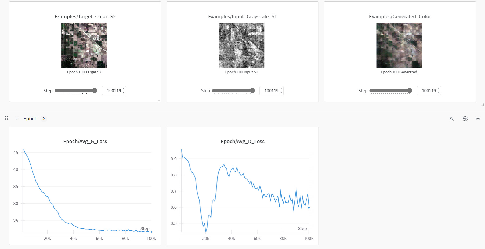
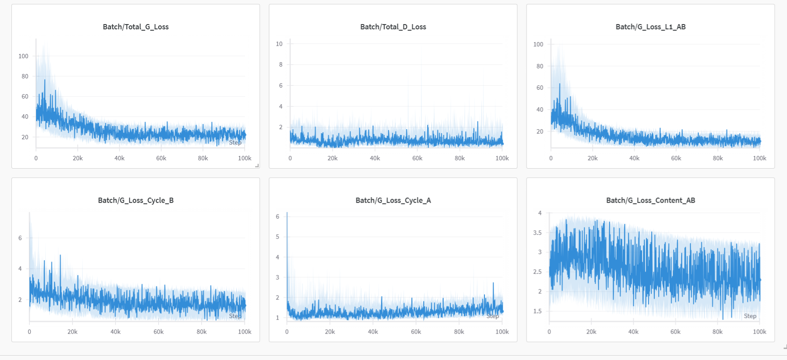
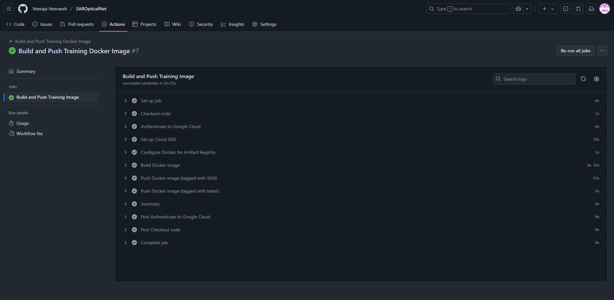
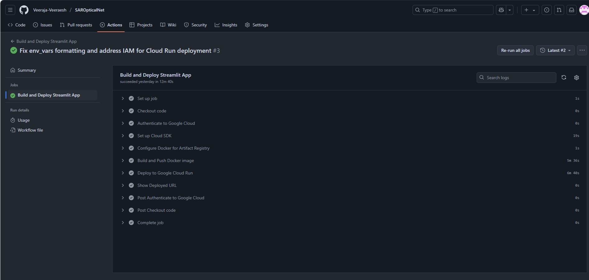

# SAR Image Colorization MLOps Project

This project implements an MLOps pipeline to train a CycleGAN-based model for colorizing Sentinel-1 (SAR) grayscale images into pseudo Sentinel-2 (optical-like) RGB images. It includes experiment tracking with MLflow, data management on Google Cloud Storage (GCS), containerized training and application environments with Docker, and CI/CD using GitHub Actions for deployment to Google Cloud Run.

<!-- Image placeholder: Overall architecture diagram -->

## Table of Contents

1.  [Project Setup](#project-setup)
2.  [Data Management (GCS)](#data-management-gcs)
3.  [MLflow Setup on GCP](#mlflow-setup-on-gcp)
4.  [Training Environment & Execution](#training-environment--execution)
5.  [Streamlit Application](#streamlit-application)
6.  [CI/CD with GitHub Actions](#cicd-with-github-actions)
7.  [Reproducing This Project](#reproducing-this-project)
8.  [Future Enhancements](#future-enhancements)

---

## 1. Project Setup

This section covers the initial local project structure and version control.

*   **1.1. Directory Structure:**
    *   Organized the project into `src/` (source code), `config/` (configurations), `notebooks/`, `.github/workflows/` (CI/CD), Dockerfiles, and `requirements.txt`.
    ```
    sarvision-mlops/
    ├── .github/workflows/
    ├── .gitignore
    ├── Dockerfile.train
    ├── Dockerfile.app
    ├── README.md
    ├── config/
    │   └── config.yaml
    ├── notebooks/
    │   └── sarvision.ipynb
    ├── src/
    │   ├── __init__.py
    │   ├── data_loader.py
    │   ├── model.py
    │   ├── train.py
    │   └── utils.py
    ├── streamlit_app.py
    ├── requirements.txt
    └── requirements_app.txt
    ```

*   **1.2. Git & GitHub:**
    *   Initialized a Git repository.
    *   Created a `.gitignore` file to exclude unnecessary files (virtual environments, local MLflow runs, large data folders, etc.).
    *   Set up a remote repository on GitHub.

*   **1.3. Code Refactoring:**
    *   The initial Jupyter Notebook (`sarvision.ipynb`) was refactored into modular Python scripts:
        *   `src/model.py`: Contains model definitions (UNetGenerator, Discriminator, VGGContentLoss).
        *   `src/data_loader.py`: Handles dataset creation (SentinelDataset) and image transformations.
        *   `src/utils.py`: Includes helper functions like `save_some_examples` and `set_seed`.
        *   `src/train.py`: The main script for training the models.
    *   `config/config.yaml`: Centralized configuration for paths, hyperparameters, and MLflow settings.

---
---

## 2. Data Management (GCS)

Handles storage and access for the large image dataset using Google Cloud Storage.

*   **2.1. Cloud Storage Choice:**
    *   Selected Google Cloud Storage (GCS) for storing the Sentinel-1 and Sentinel-2 image pairs due to dataset size.
    *   This avoids committing large data files to the Git repository.

*   **2.2. GCS Bucket Setup:**
    *   Created a GCS bucket (e.g., `your-unique-sarvision-data`) to host the dataset.
    *   Uploaded the `v_2` image data (segregated by terrain, e.g., `agri/s1/`, `agri/s2/`) to a structured path within this bucket (e.g., `gs://your-unique-sarvision-data/datasets/sentinel12_terrain/v_2_original/`).

*   **2.3. Configuration Update:**
    *   Updated `config/config.yaml` to point `DATA_DIR` to the GCS URI.
    *   Added `GCS_BUCKET_NAME` and `GCP_PROJECT_ID` to `config.yaml` for use by the data loader.

*   **2.4. Data Loader Modification (`src/data_loader.py`):**
    *   The `SentinelDataset` class was enhanced to:
        *   Detect if `root_dir` is a GCS path (`gs://...`) or a local path.
        *   Initialize a `google.cloud.storage.Client` (passing the `gcp_project_id`) in the main process (`__init__`) for listing files from GCS.
        *   Store necessary GCS information (bucket name, prefix, project ID) for worker processes.
        *   Implement worker-local GCS client initialization (`_get_worker_gcs_client`, `_get_worker_gcs_bucket`) for `DataLoader` workers (`num_workers > 0`) to download image bytes from GCS during `__getitem__`. This handles non-picklable client objects.

---
---

## 3. MLflow Setup on GCP

Established a centralized MLflow Tracking Server on Google Cloud Platform for experiment tracking, model logging, and model registry functionalities.

*   **3.1. MLflow Server Architecture:**
    *   Deployed an MLflow Tracking Server on a Google Compute Engine (GCE) VM (e.g., `mlflow-server-vm`).
    *   **Backend Store:** Configured a Cloud SQL (PostgreSQL) instance as the backend store for MLflow metadata (runs, parameters, metrics).
    *   **Artifact Store:** Configured a separate GCS bucket (e.g., `your-unique-mlflow-artifacts-bucket`) as the default artifact root for storing models, images, and other files logged during runs.

*   **3.2. Secure Database Connection (Cloud SQL Proxy & Secret Manager):**
    *   The GCE VM running the MLflow server uses the **Cloud SQL Auth Proxy** to connect securely to the Cloud SQL instance without exposing the database to a public IP.
    *   The database password for the MLflow user is stored securely in **Google Secret Manager**.
    *   A startup script (`start_mlflow_services.sh`) on the MLflow server VM:
        *   Fetches the database password from Secret Manager at runtime.
        *   Starts the Cloud SQL Auth Proxy in the background.
        *   Starts the `mlflow server` command, configured to use the proxy (via `127.0.0.1`) for the backend store and the GCS bucket for artifacts.

*   **3.3. IAM Permissions for MLflow Server VM:**
    *   The service account associated with the `mlflow-server-vm` was granted necessary IAM roles:
        *   `Secret Manager Secret Accessor` (to read the DB password).
        *   `Cloud SQL Client` (to connect via the proxy).
        *   `Storage Object Admin` (to write artifacts to the MLflow GCS bucket).

*   **3.4. Firewall Rules:**
    *   A firewall rule was configured on GCP to allow incoming TCP traffic to the `mlflow-server-vm` on the MLflow port (e.g., `5000`) so the MLflow UI and clients can connect.

*   **3.5. Training Script Integration (`src/train.py`):**
    *   The `MLFLOW_TRACKING_URI` in `config/config.yaml` was updated to point to the public IP and port of the GCP-hosted MLflow server.
    *   `src/train.py` was enhanced to:
        *   Set the MLflow experiment.
        *   Log parameters from `config.yaml` and the Git commit hash.
        *   Log batch-wise and epoch-wise metrics (losses).
        *   Log example images generated during training as artifacts using `mlflow.log_artifact()`.
        *   Log trained PyTorch models (Generator_AB, Generator_BA, Discriminators) using `mlflow.pytorch.log_model()`.
        *   Register the primary generator model (`gen_AB`) to the MLflow Model Registry under a configured name (e.g., `SAR_Generator_AB`).
        *   Log a final loss plot as an artifact.
    
    

*   **3.6. Model Lifecycle Management (Shift from Stages to Aliases/Tags):**
    *   Acknowledged the deprecation of MLflow Model Stages.
    *   Adopted the use of **Model Version Aliases** (e.g., `prod-candidate`, `champion`) and **Model Version Tags** (e.g., `validation_status:passed`) for managing the lifecycle and status of registered model versions. This will be used by the Streamlit app to fetch appropriate models.

---

---

## 4. Training Environment & Execution

Containerized the training process using Docker for consistency and portability, and outlined how to run it on GCE.

*   **4.1. Dockerfile for Training (`Dockerfile.train`):**
    *   Created `Dockerfile.train` to define the training environment.
    *   **Base Image:** Selected a PyTorch base image from Docker Hub (e.g., `pytorch/pytorch:2.0.1-cuda11.7-cudnn8-devel` or a CPU equivalent if GPUs are not used).
    *   Installed system dependencies like `git` (for `GitPython` to log commit hashes).
    *   Copied `requirements.txt` and installed Python dependencies.
    *   Copied the project source code (`src/`, `config/`) into the image.
    *   Set the `ENTRYPOINT` to run `python src/train.py`.

*   **4.2. GCP Project ID Handling:**
    *   Modified `src/data_loader.py` so that `storage.Client()` (both in the main process for listing and in worker-local initializations) is explicitly initialized with the `gcp_project_id` read from `config.yaml`.
    *   Ensured the `GOOGLE_CLOUD_PROJECT` environment variable is set when running the Docker container (especially when running locally or if any other library within the container needs it for ADC). This helps Google Cloud client libraries determine the project context for billing and API calls.

*   **4.3. Building and Pushing Training Image:**
    *   The training Docker image is built using `docker build -f Dockerfile.train .`.
    *   The image is tagged (e.g., `asia-south1-docker.pkg.dev/YOUR_PROJECT_ID/YOUR_REPO/sarvision-train:TAG`) and pushed to Google Artifact Registry.

*   **4.4. Running Training on GCE VM (CPU-only for Free Tier):**
    *   **VM Setup:** A GCE VM is prepared for running the training container.
        *   Docker and `gcloud` CLI are installed.
        *   Docker is configured to authenticate with Artifact Registry (`gcloud auth configure-docker ...`).
        *   The VM's service account has roles: `Artifact Registry Reader` (to pull the image) and `Storage Object Viewer` (to read training data from GCS).
    *   **Configuration for CPU:**
        *   The `DEVICE` in `config/config.yaml` (baked into the image or overridden) can be set to `"cpu"`. The training script already defaults to CPU if CUDA is unavailable.
    *   **Execution Command:**
        ```bash
        docker run --rm -it \
            -e "GOOGLE_CLOUD_PROJECT=YOUR_GCP_PROJECT_ID" \
            YOUR_ARTIFACT_REGISTRY_IMAGE_URI # e.g., asia-south1-docker.pkg.dev/.../sarvision-train:latest
        ```
        *   The `GOOGLE_CLOUD_PROJECT` environment variable ensures that MLflow (when logging artifacts to GCS) and other Google client libraries within the container can correctly identify the project.
        *   Application Default Credentials (ADC) are automatically available from the GCE metadata server, so no credential mounting is needed when running on GCE.

---
---

## 5. Streamlit Application

Developed a web application using Streamlit to provide a user interface for the SAR image colorization model.

*   **5.1. Application Functionality (`streamlit_app.py`):**
    *   Allows users to upload a Sentinel-1 grayscale image.
    *   Loads the trained `gen_AB` (SAR to Optical) model from the MLflow Model Registry.
        *   **Model Loading by Alias:** Instead of using deprecated stages, the app fetches a model version based on a pre-defined **alias** (e.g., `prod-candidate`, `champion`) specified in `config/config.yaml`. This allows for flexible model deployment.
        *   Uses `mlflow.tracking.MlflowClient().get_model_version_by_alias()` to find the model version and its source URI.
        *   Uses `mlflow.pytorch.load_model()` with the source URI to load the PyTorch model.
    *   Preprocesses the input image.
    *   Performs inference using the loaded model.
    *   Denormalizes and displays the original S1 input and the generated colorized S2-like output.
    *   Uses `@st.cache_resource` to cache the loaded model for better performance.
    
    
*   **5.2. Configuration for Streamlit:**
    *   Added app-specific settings to `config/config.yaml`:
        *   `MODEL_ALIAS_TO_LOAD`: Specifies the MLflow model alias the app should use.
        *   `DEVICE_STREAMLIT`: Sets the inference device for the Streamlit app (typically "cpu" for wider deployability).
    *   Created `requirements_app.txt` for Streamlit-specific Python dependencies.

*   **5.3. Local Testing:**
    *   The Streamlit app was tested locally by:
        *   Ensuring the MLflow server (on GCE) was accessible.
        *   Manually setting the desired alias (e.g., `prod-candidate`) on a trained model version in the MLflow UI.
        *   Running `streamlit run streamlit_app.py`.

*   **5.4. Dockerfile for Streamlit App (`Dockerfile.app`):**
    *   Created `Dockerfile.app` to containerize the Streamlit application.
    *   Uses a lean Python base image (e.g., `python:3.11-slim`).
    *   Installs dependencies from `requirements_app.txt`.
    *   Copies `streamlit_app.py`, the `src/` directory (for model definitions), and `config/` directory.
    *   Exposes port `8080` (common for Cloud Run).
    *   Sets the `ENTRYPOINT` to run `streamlit run streamlit_app.py --server.port=8080 --server.address=0.0.0.0`.

*   **5.5. Building and Pushing Streamlit App Image:**
    *   The Streamlit app Docker image is built using `docker build -f Dockerfile.app .`.
    *   Tagged and pushed to Google Artifact Registry (e.g., `asia-south1-docker.pkg.dev/YOUR_PROJECT_ID/YOUR_REPO/sarvision-streamlit-app:TAG`).

---
---

## 6. CI/CD with GitHub Actions

Automated key parts of the development and deployment lifecycle using GitHub Actions.

*   **6.1. Goals:**
    *   **Continuous Integration (CI) for Environments:** Automatically build and push Docker images for the training environment and the Streamlit application to Google Artifact Registry when relevant code changes.
    *   **Continuous Deployment (CD) for Streamlit Application:** Automatically deploy the updated Streamlit application container to Google Cloud Run.
    *   **Training Trigger:** Kept manual (running the training Docker container as needed) to control resource usage, rather than fully automated training on every merge.

*   **6.2. GCP Authentication from GitHub Actions:**
    *   Configured **Workload Identity Federation** in GCP to allow GitHub Actions to securely authenticate to Google Cloud without using long-lived service account keys.
        *   Created a Workload Identity Pool and an OIDC Provider for GitHub.
        *   Created a dedicated GCP Service Account (`github-actions-sa`) for GitHub Actions.
        *   Granted this service account necessary IAM roles:
            *   `Artifact Registry Writer` (to push Docker images).
            *   `Cloud Run Admin` (to deploy and manage the Streamlit app on Cloud Run).
            *   `Workload Identity User` (to allow federated identities to impersonate this SA).
        *   Linked the GitHub repository/branch to this service account via the Workload Identity Pool.
    *   Stored necessary GCP identifiers (project ID, WIF provider, SA email, Artifact Registry details) as **GitHub Secrets**.

*   **6.3. GitHub Actions Workflow for Training Image (`.github/workflows/build_and_push_train_image.yml`):**
    *   **Trigger:** On pushes to `main` if files in `src/`, `config/`, `Dockerfile.train`, `requirements.txt`, or the workflow itself change. Also allows manual trigger (`workflow_dispatch`).
    *   **Steps:**
        1.  Checks out code.
        2.  Authenticates to GCP using `google-github-actions/auth` with Workload Identity Federation.
        3.  Sets up `gcloud` SDK using `google-github-actions/setup-gcloud`.
        4.  Configures Docker to authenticate with Google Artifact Registry.
        5.  Builds the training Docker image (`Dockerfile.train`).
            *   Tags the image with a short Git SHA for versioning and also with `latest`.
        6.  Pushes both image tags to Artifact Registry.
    

*   **6.4. GitHub Actions Workflow for Streamlit App (`.github/workflows/deploy_streamlit_app.yml`):**
    *   **Trigger:** On pushes to `main` if `streamlit_app.py`, relevant `src/` files, `Dockerfile.app`, `requirements_app.txt`, or the workflow itself change. Also allows manual trigger.
    *   **Steps:**
        1.  Checks out code.
        2.  Authenticates to GCP (same as training workflow).
        3.  Sets up `gcloud` SDK.
        4.  Configures Docker for Artifact Registry.
        5.  Builds the Streamlit app Docker image (`Dockerfile.app`).
            *   Tags the image with a short Git SHA and `latest`.
        6.  Pushes both image tags to Artifact Registry.
        7.  **Deploys to Google Cloud Run** using `google-github-actions/deploy-cloudrun`.
            *   Specifies the service name, region, and the SHA-tagged image URI for deployment.
            *   Passes necessary environment variables to Cloud Run (e.g., `GOOGLE_CLOUD_PROJECT`, `MLFLOW_TRACKING_URI`, `MODEL_ALIAS_TO_LOAD` via GitHub Secrets).
            *   Configures Cloud Run settings (e.g., allow unauthenticated, min/max instances, CPU/memory).
    

---
---

## 7. Reproducing This Project

Follow these steps to set up and run this MLOps pipeline.

*   **Prerequisites:**
    *   Git installed.
    *   Google Cloud SDK (`gcloud`) installed and authenticated locally.
    *   Docker Desktop (or Docker engine) installed locally.
    *   A Google Cloud Platform (GCP) project with billing enabled.
    *   A GitHub account and a repository for this project.

*   **Step 1: Clone the Repository**
    ```bash
    git clone <your-github-repo-url>
    cd <your-repo-name> # e.g., sarvision-mlops
    ```

*   **Step 2: GCP Setup**
    1.  **Enable APIs:** In your GCP project, ensure the following APIs are enabled:
        *   Compute Engine API
        *   Cloud Storage API / Google Cloud Storage JSON API
        *   Cloud SQL Admin API
        *   Secret Manager API
        *   Artifact Registry API
        *   Cloud Run API
        *   IAM Service Account Credentials API
        *   Cloud Build API (optional, if used directly)
        *   IAM API
        *   Cloud Resource Manager API
    2.  **Create GCS Buckets:**
        *   One for training data (e.g., `your-project-id-sar-data`).
        *   One for MLflow artifacts (e.g., `your-project-id-mlflow-artifacts`).
    3.  **Upload Training Data:** Upload your Sentinel-1/2 image pairs to the training data GCS bucket, following the structure expected by `src/data_loader.py` (e.g., `gs://<bucket>/datasets/sentinel12_terrain/v2_original/agri/s1/...`).
    4.  **Create Cloud SQL Instance:** Set up a PostgreSQL instance for the MLflow backend store (e.g., `mlflow-db-instance`). Create a database (e.g., `mlflow_db`) and a user (e.g., `mlflow_user`) with a password.
    5.  **Store DB Password in Secret Manager:** Store the Cloud SQL user's password in Secret Manager (e.g., secret name `mlflow-db-password`).
    6.  **Set up GCE VM for MLflow Server:**
        *   Create a GCE VM (e.g., `mlflow-server-vm`).
        *   Assign a service account to this VM. Grant this service account roles:
            *   `Secret Manager Secret Accessor` (for the DB password secret).
            *   `Cloud SQL Client` (to connect to your Cloud SQL instance).
            *   `Storage Object Admin` (on the MLflow artifacts GCS bucket).
        *   Install Docker, `gcloud`, Python, `pip`, `venv`, `psycopg2-binary`, `mlflow`, `gcsfs`, and the Cloud SQL Auth Proxy on this VM.
        *   Copy the `start_mlflow_services.sh` script (from Part 2, updated for Secret Manager) to this VM.
        *   Configure the script with your specific SQL instance connection name, DB user, DB name, artifact bucket URI, and Secret Manager resource ID.
        *   Run `chmod +x start_mlflow_services.sh`.
        *   Start the MLflow server using `./start_mlflow_services.sh`.
        *   Configure a firewall rule to allow TCP traffic on port 5000 (or your MLflow port) to this VM. Note its external IP.
    7.  **Configure Workload Identity Federation for GitHub Actions:**
        *   Follow steps in Part 6.2 to create a Workload Identity Pool, OIDC Provider for GitHub, and a dedicated service account (`github-actions-sa`).
        *   Grant `github-actions-sa` roles: `Artifact Registry Writer`, `Cloud Run Admin`, `Workload Identity User`.
        *   Link your GitHub repo/branch to this SA via the WIF Pool.

*   **Step 3: Configure Project Files**
    1.  **`config/config.yaml`:**
        *   Update `GCP_PROJECT_ID`.
        *   Update `DATA_DIR`, `GCS_BUCKET_NAME`, `GCS_DATA_PREFIX` to your GCS training data paths.
        *   Update `MLFLOW_TRACKING_URI` to the external IP and port of your `mlflow-server-vm`.
        *   Review other hyperparameters and settings.
    2.  **GitHub Secrets:** In your GitHub repository settings, add all secrets required by the workflows in `.github/workflows/` (e.g., `GCP_PROJECT_ID`, `GCP_WORKLOAD_IDENTITY_PROVIDER`, `GCP_SERVICE_ACCOUNT_EMAIL`, `ARTIFACT_REGISTRY_REPO`, `IMAGE_NAME_TRAIN`, `GCP_ARTIFACT_REGISTRY_REGION`, `ARTIFACT_REGISTRY_IMAGE_REPO_NAME`, `MLFLOW_TRACKING_URI_PUBLIC`, `MODEL_ALIAS_FOR_PROD`).

*   **Step 4: Build Initial Docker Images (via GitHub Actions)**
    1.  Commit and push your configured `config/config.yaml`, `Dockerfile.train`, `Dockerfile.app`, and workflow files to your GitHub `main` branch.
    2.  This should trigger the GitHub Actions defined in `.github/workflows/`.
    3.  Monitor the Actions runs. They should build and push the `sarvision-train` and `sarvision-streamlit-app` Docker images to your Google Artifact Registry. The Streamlit app workflow will also attempt to deploy to Cloud Run.

*   **Step 5: Run a Training Manually**
    1.  SSH into a GCE VM configured for training (as detailed in Part 4.4, ensuring it has Docker, `gcloud` configured for Artifact Registry, and appropriate service account permissions like `Artifact Registry Reader` and `Storage Object Viewer` for training data).
    2.  Pull your training image:
        ```bash
        docker pull YOUR_ARTIFACT_REGISTRY_IMAGE_URI # e.g., asia-south1-docker.pkg.dev/.../sarvision-train:latest
        ```
    3.  Run the training container:
        ```bash
        docker run --rm -it \
            -e "GOOGLE_CLOUD_PROJECT=YOUR_GCP_PROJECT_ID" \
            YOUR_ARTIFACT_REGISTRY_IMAGE_URI
        ```
    4.  Monitor the training logs and check the MLflow UI for the new run and model versions.

*   **Step 6: Promote a Model Version in MLflow**
    1.  After a successful training run, go to your MLflow UI.
    2.  Navigate to "Models" > `SAR_Generator_AB`.
    3.  Select a trained version.
    4.  Under "Aliases", add the alias specified in `config.yaml` for `MODEL_ALIAS_TO_LOAD` (e.g., `prod-candidate`).

*   **Step 7: Access Deployed Streamlit Application**
    1.  If the `deploy_streamlit_app.yml` GitHub Action was successful, it will output the URL of your deployed Cloud Run service.
    2.  Open this URL in your browser to use the Streamlit application. It should load the model version corresponding to the alias you set.

---
---

## 8. Future Enhancements

This project provides a solid MLOps foundation. Here are potential areas for future development:

*   **8.1. Automated Model Evaluation & Promotion:**
    *   Create a separate script or pipeline stage for automated model evaluation using a held-out test set.
    *   Metrics from evaluation could be logged to MLflow.
    *   Set up a GitHub Actions workflow that triggers after training, runs evaluation, and if metrics meet thresholds, automatically sets a "validated" tag or promotes an alias (e.g., `staging-candidate` to `prod-candidate`).

*   **8.2. More Sophisticated CI/CD for Models (CD4ML):**
    *   Implement a full "Continuous Delivery for Machine Learning" pipeline where models are automatically promoted through different environments (e.g., dev -> staging -> production registered models in MLflow, or using aliases like `dev`, `staging`, `prod` on a single registered model).
    *   This could involve automated A/B testing or canary deployments for the Streamlit app if multiple model versions are live.

*   **8.3. Data and Model Monitoring:**
    *   Implement monitoring for input data drift (for training data).
    *   Monitor the performance of the deployed model in the Streamlit app (e.g., prediction latency, output quality if feedback is collected).
    *   Set up alerts for performance degradation or data drift.

*   **8.4. Hyperparameter Tuning Automation:**
    *   Integrate tools like Optuna or Hyperopt with MLflow to automate hyperparameter tuning for the GAN.
    *   Each tuning trial would be an MLflow run, making it easy to compare results.

*   **8.5. Scalable Training with Vertex AI:**
    *   Adapt the training Docker container to run as a custom training job on Google Cloud Vertex AI Training. This provides managed, scalable compute resources (including GPUs if you upgrade your GCP tier) and can be triggered via API or `gcloud`.
    *   The GitHub Actions workflow for training could be extended to submit a Vertex AI Training job instead of just building an image.

*   **8.6. Feature Store (If Applicable):**
    *   If preprocessing becomes complex or features are shared across models, consider integrating a feature store like Vertex AI Feature Store or Feast. (Less critical for this specific image-to-image task unless specific SAR features are extracted).

*   **8.7. Cost Management and Optimization:**
    *   Implement strategies to optimize GCS storage classes (e.g., for older artifacts).
    *   Optimize GCE VM types and Cloud Run configurations for cost-effectiveness.
    *   Set up budget alerts in GCP.

*   **8.8. Advanced Model Versioning with DVC:**
    *   Integrate Data Version Control (DVC) to version the GCS training data alongside code, providing even more precise reproducibility. DVC would store small metafiles in Git pointing to the actual data in GCS.

*   **8.9. Unit and Integration Tests:**
    *   Add unit tests for individual functions in `src/` (e.g., for transforms, utility functions).
    *   Add integration tests for data loading, model forward passes, and perhaps basic MLflow interactions.
    *   Incorporate these tests into a GitHub Actions CI workflow that runs on pull requests or pushes.

*   **8.10. Enhanced Streamlit App:**
    *   Allow users to adjust model parameters (if applicable for inference).
    *   Provide more detailed feedback or quality scores for the generated images.
    *   User authentication and a gallery of examples.

---
